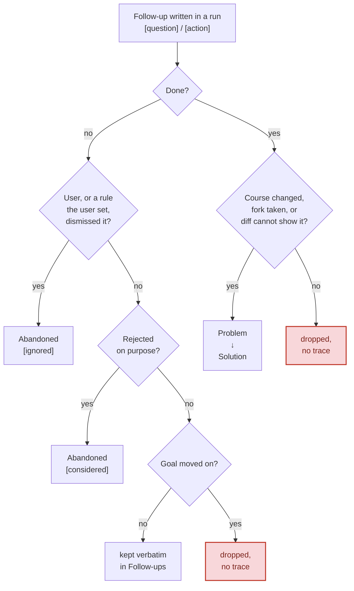

# work-report

A Claude skill that writes `WORK-REPORT.md` at your working tree's root, summarizing what an agent did. A reviewer or a fresh session reads it instead of re-deriving intent from the raw diff.

One report per working tree, overwritten each run, so a job resumed across three days still leaves one current report. Works in a worktree, the main checkout, a plain clone, or a directory outside git.

It records what the diff can't show - intent, reasoning, what was verified, what's left - and references artifacts (PRs, ADRs, file paths) instead of duplicating them. Secrets (API keys, passwords, tokens, credentials, PII) are noted by name and location, never by value.

## Install

As a Claude Code plugin (from the [dev-skills](https://github.com/pilniczek/dev-skills) marketplace):

```text
/plugin marketplace add pilniczek/dev-skills
/plugin install work-report@dev-skills
```

Or vendor it into your repo with skills.sh:

```bash
npx skills add https://github.com/pilniczek/dev-skills --skill work-report
```

[skills.sh/pilniczek/dev-skills](https://skills.sh/pilniczek/dev-skills/work-report)

## The five sections

**Goal**, **Problem → Solution**, **Follow-ups**, **Suggested skills**, and **Abandoned**, each always present (`- none` when empty). What belongs in each: [Step 4 of SKILL.md](SKILL.md#step-4---compose-the-report).

## Follow-ups across runs

Each run decides what became of the previous run's follow-ups, which keeps the report bounded across resumed sessions:



Only you can mark something `[ignored]`, directly or through a rule you set: a review bar such as "fix blockers only", or a rule in the repo's instruction files. An agent that judges an item not worth doing tags it `[considered]` instead. Later runs never re-raise an `[ignored]` entry until you ask for that work again or change the rule; a new bug sharing its root cause only adds a question asking whether it reopens. See [Step 4 of SKILL.md](SKILL.md#step-4---compose-the-report).

Work done outside the repo (a pipeline run inspected, an email sent, a console flag toggled, a flow exercised by hand) is never in the diff, so a finished follow-up of that kind always lands in Problem → Solution.

## Auto-activation

Claude raises this skill when you signal work is finished: "done", "ready to commit", "wrapping up", or a handoff to another agent. It never writes silently: a proactive activation offers first and waits for your go-ahead, while typing `/work-report` is itself the go-ahead. See [the gate in SKILL.md](SKILL.md#never-write-without-being-asked).

## Where it lives, and git

`WORK-REPORT.md` is a local artifact kept out of the branch diff. On its first run in a repo the skill offers to add `/WORK-REPORT.md` to `.gitignore`; declining doesn't block the report. To share it on a PR, commit it with `git add -f WORK-REPORT.md`.

## Self-report

The author's account of intent and reasoning, pointing at the changes. Not an audit, and not a substitute for reading the diff when correctness matters.

## Contributing

See [CONTRIBUTING.md](https://github.com/pilniczek/dev-skills/blob/master/CONTRIBUTING.md) for local setup and the pre-release security scan workflow.
