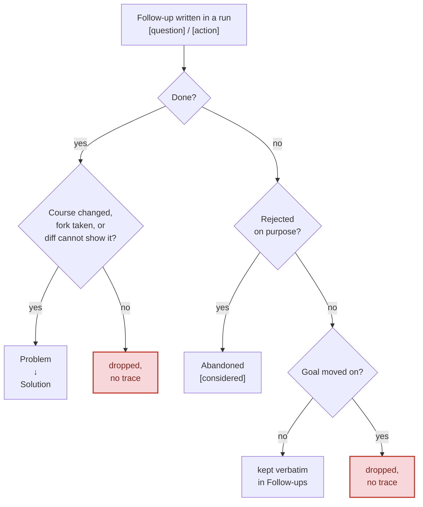

# work-report

A Claude skill that writes `WORK-REPORT.md` at your working tree's root, summarizing what an agent did. A reviewer or a fresh session continuing the work reads it instead of re-deriving intent from the raw diff - a concise report is a faster substrate for the next step than studying the changes.

One report per working tree. Each run reads the existing one and overwrites it, so it reflects current state rather than a pile of fragments, and a job resumed across three days still leaves a reviewer exactly one report to read. Works in any repo: a worktree, the main checkout, a plain clone, or a directory outside git.

It doesn't restate the git diff - commits and changed files come from git or the PR; what the diff can't show is intent, reasoning, what was verified, and what's left over. It references artifacts (PRs, ADRs, file paths) instead of duplicating them, and redacts secrets: any API key, password, token, credential, or PII is noted by name and location, never by value.

## Install

As a Claude Code plugin (from the [dev-skills](https://github.com/pilniczek/dev-skills) marketplace):

```text
/plugin marketplace add pilniczek/dev-skills
/plugin install work-report@dev-skills
```

Or vendor it into your repo with skills.sh:

```bash
npx skills add https://github.com/pilniczek/dev-skills --skill work-report
```

[skills.sh/pilniczek/dev-skills](https://skills.sh/pilniczek/dev-skills/work-report)

## The five sections

**Goal**, **Problem → Solution**, **Follow-ups**, **Suggested skills**, and **Abandoned** (omitted if none). What belongs in each and how it's written lives in [Step 4 of SKILL.md](SKILL.md#step-4---compose-the-report), the single source of truth.

## Follow-ups across runs

Follow-ups are the one part that moves: a run writes them, the next run - the same session refreshing the report counts - decides what became of each. That disposition is what stops the report growing unbounded across a week of resumed sessions.



Work done outside the repo is never recoverable from the diff - a pipeline run inspected, an email sent, a flag toggled in a console, a flow exercised by hand - so a finished follow-up of that kind always lands in Problem → Solution.

## Auto-activation

Claude raises this skill when you signal work is finished: "done", "ready to commit", "wrapping up", or a handoff to another agent. It never writes silently: a proactive activation offers first and waits for your go-ahead, while typing `/work-report` yourself is the go-ahead and skips the offer. See [the gate in SKILL.md](SKILL.md#never-write-without-being-asked).

## Where it lives, and git

`WORK-REPORT.md` stays a local working artifact so it never pollutes the branch diff. On its first run in a repo the skill checks `.gitignore` for `/WORK-REPORT.md` and offers to add it if missing; declining doesn't block the report. To hand the report to a reviewer working from the PR rather than the filesystem, commit it deliberately with `git add -f WORK-REPORT.md`.

## Self-report

The author's account of intent and reasoning, pointing at the changes. Not an audit, and not a substitute for reading the diff when correctness matters.

## Contributing

See [CONTRIBUTING.md](https://github.com/pilniczek/dev-skills/blob/master/CONTRIBUTING.md) for local setup and the pre-release security scan workflow.
